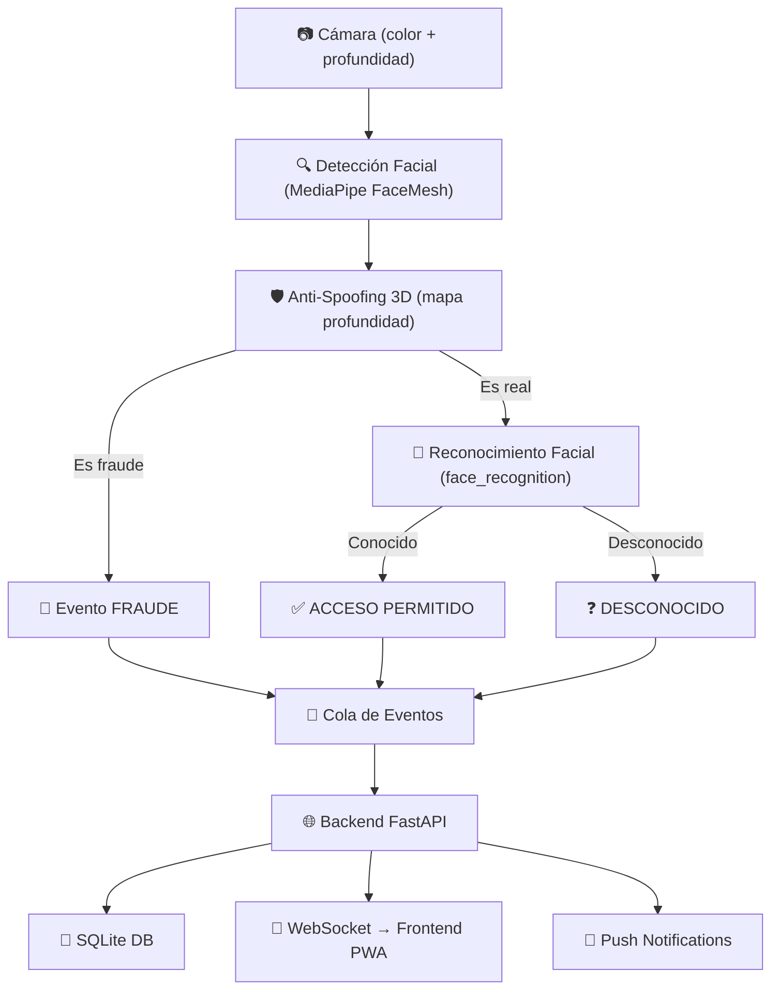

# 🛡️ DepthGuard — Arquitectura del Proyecto

Sistema de **Control de Acceso Biométrico 3D** que usa cámara de profundidad + reconocimiento facial + anti-spoofing para detectar si una persona es real o es una foto/pantalla.

---

## Flujo General



---

## Punto de Entrada

#### [iniciar.py](file:///c:/Users/WinterOS/Desktop/DepthGuard/iniciar.py)

Arranca todo el sistema con `python iniciar.py`:

1. Carga configuración desde [.env](file:///c:/Users/WinterOS/Desktop/DepthGuard/.env) vía [config/settings.py](file:///c:/Users/WinterOS/Desktop/DepthGuard/config/settings.py)
2. Inicializa la **base de datos** SQLite
3. Crea una `queue.Queue()` para comunicar el Motor IA → Backend
4. Lanza el **Pipeline IA** en un hilo separado (`threading.Thread`)
5. Inicia el servidor **FastAPI** con Uvicorn en el hilo principal

---

## Componentes

### 1. ⚙️ Configuración — `config/`

#### [settings.py](file:///c:/Users/WinterOS/Desktop/DepthGuard/config/settings.py)
Lee el archivo [.env](file:///c:/Users/WinterOS/Desktop/DepthGuard/.env) y exporta variables globales:

| Variable | Descripción |
|---|---|
| `MODO_CAMARA` | `"simulada"` (webcam) o `"realsense"` (Intel RealSense) |
| `PORT` | Puerto del servidor (default 8000) |
| `UMBRAL_VARIANZA` | Umbral para detectar superficie plana (fraude) |
| `TOLERANCIA_FACIAL` | Distancia máxima para reconocer un rostro |
| `COOLDOWN_*` | Intervalos entre operaciones costosas |
| `VAPID_*` | Claves para push notifications |

---

### 2. 🤖 Motor IA — `motor_ia/`

Pipeline que corre en **bucle infinito** en un hilo separado.

#### [pipeline.py](file:///c:/Users/WinterOS/Desktop/DepthGuard/motor_ia/pipeline.py) — Orquestador
Cada frame pasa por 4 etapas:
1. **Cámara** → obtener frame color + mapa de profundidad
2. **Detección** → encontrar rostro + bbox + ángulo
3. **Anti-spoofing** → verificar que el rostro es 3D real (no foto)
4. **Reconocimiento** → generar embedding 128D y buscar en caché

Resultados posibles enviados a la cola:
- `FRAUDE` → superficie plana detectada
- `ACCESO_PERMITIDO` → persona reconocida
- `DESCONOCIDO` → persona no registrada
- `REGISTRO_EMBEDDING` → captura durante registro de usuario

#### Submódulos:

| Módulo | Archivo | Función |
|---|---|---|
| **Cámara** | [factory.py](file:///c:/Users/WinterOS/Desktop/DepthGuard/motor_ia/camara/factory.py) | Elige cámara según `MODO_CAMARA` |
| | [simulada.py](file:///c:/Users/WinterOS/Desktop/DepthGuard/motor_ia/camara/simulada.py) | Webcam + profundidad artificial generada por software |
| | [realsense.py](file:///c:/Users/WinterOS/Desktop/DepthGuard/motor_ia/camara/realsense.py) | Intel RealSense D400 (profundidad real) |
| **Detección** | [face_mesh.py](file:///c:/Users/WinterOS/Desktop/DepthGuard/motor_ia/deteccion/face_mesh.py) | MediaPipe FaceMesh: bbox + ángulo del rostro |
| **Anti-spoofing** | [verificador_3d.py](file:///c:/Users/WinterOS/Desktop/DepthGuard/motor_ia/antispoofing/verificador_3d.py) | Analiza mapa de profundidad: varianza, rango, distancia |
| **Reconocimiento** | [embedding_generator.py](file:///c:/Users/WinterOS/Desktop/DepthGuard/motor_ia/reconocimiento/embedding_generator.py) | `face_recognition`: embeddings 128D + búsqueda en caché |

---

### 3. 🌐 Backend — `backend/`

#### [servidor.py](file:///c:/Users/WinterOS/Desktop/DepthGuard/backend/servidor.py) — API FastAPI

Endpoints:
| Ruta | Método | Función |
|---|---|---|
| `/` | GET | Estado del sistema |
| `/api/health` | GET | Health check |
| `/login` | POST | Login admin |
| `/usuarios` | GET | Lista usuarios registrados |
| `/usuarios/{id}` | DELETE | Eliminar usuario |
| `/registrar_usuario` | POST | Iniciar registro facial |
| `/registro_estado` | GET | Verificar progreso del registro |
| `/historial` | GET | Historial de eventos |
| `/suscribir_push` | POST | Suscribir a push notifications |
| `/ws` | WebSocket | Eventos en tiempo real al frontend |

Un hilo [_procesar_cola](file:///c:/Users/WinterOS/Desktop/DepthGuard/backend/servidor.py#129-168) lee la `queue.Queue` del Pipeline IA y:
- Guarda en la DB
- Envía por WebSocket al frontend
- Envía push notifications si hay fraude o desconocido

#### [base_datos.py](file:///c:/Users/WinterOS/Desktop/DepthGuard/backend/base_datos.py) — SQLite

Tablas: [admin](file:///c:/Users/WinterOS/Desktop/DepthGuard/backend/base_datos.py#86-95), `usuarios_biometricos` (embeddings JSON), [historial](file:///c:/Users/WinterOS/Desktop/DepthGuard/backend/servidor.py#75-78), [suscripciones_push](file:///c:/Users/WinterOS/Desktop/DepthGuard/backend/base_datos.py#183-190)

#### [notificaciones.py](file:///c:/Users/WinterOS/Desktop/DepthGuard/backend/notificaciones.py) — Web Push vía VAPID

---

### 4. 📱 Frontend — `frontend_pwa/`

PWA (Progressive Web App) servida como archivos estáticos:
- [index.html](file:///c:/Users/WinterOS/Desktop/DepthGuard/frontend_pwa/public/index.html) — UI completa
- [sw.js](file:///c:/Users/WinterOS/Desktop/DepthGuard/frontend_pwa/public/sw.js) — Service Worker para notificaciones
- [manifest.json](file:///c:/Users/WinterOS/Desktop/DepthGuard/frontend_pwa/public/manifest.json) — Manifest para instalación

---

## Cómo Ejecutar

```bash
# 1. Activar entorno virtual
.\venv\Scripts\activate

# 2. Ejecutar
python iniciar.py
```

Esto arranca la cámara + IA + servidor en `http://localhost:8000`

---

## Arquitectura en Resumen

```
iniciar.py
├── Hilo 1: Pipeline IA (bucle infinito)
│   ├── Cámara → frames (color + profundidad)
│   ├── FaceMesh → detección + bbox + ángulo
│   ├── Anti-spoofing → verificar 3D real
│   └── Reconocimiento → embedding + buscar
│       └── → queue.Queue (eventos)
│
└── Hilo Principal: Servidor FastAPI
    ├── Hilo interno: procesar cola
    │   ├── → SQLite (guardar historial)
    │   ├── → WebSocket (notificar frontend)
    │   └── → Push (notificar móviles)
    └── API REST + WebSocket + archivos estáticos
```
